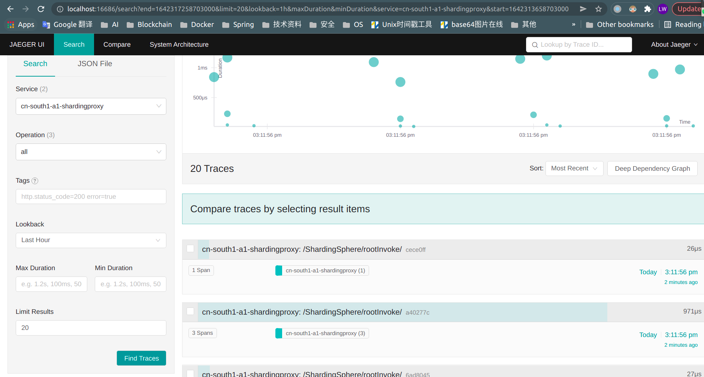
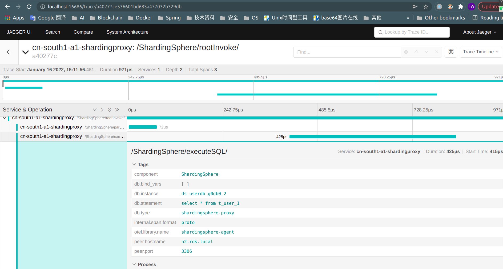

# An cloud-native db-sharding service based on [shardingsphere-proxy](https://github.com/apache/shardingsphere/tree/master/shardingsphere-proxy)

> It's an enhanced package that integrates shardingsphere-proxy and shardingsphere-scaling

## 1. Deployment guide

### 1.1 Preparing MySQL MGR cluster for testing

- You first need to prepare a multi-instance DB cluster for testing, here is `MySQL Group Replication` as an example. Refer docs to: [Deploy MGR high-availability production cluster based on Docker](https://blogs.wl4g.com/archives/2477)

- Assuming that the MGR cluster is now ready as follows:

```sql
SELECT
    (SELECT gv.VARIABLE_VALUE FROM performance_schema.global_variables gv WHERE gv.VARIABLE_NAME='group_replication_group_name') AS GROUP_NAME,
    rgm.MEMBER_ID AS nodeId,
    rgm.MEMBER_HOST AS nodeHost,
    rgm.MEMBER_PORT AS nodePort,
    rgm.MEMBER_STATE AS nodeState,
    @@read_only AS readOnly,
    @@super_read_only AS superReadOnly,(
    CASE (SELECT TRIM(VARIABLE_VALUE) FROM `performance_schema`.`global_status` WHERE VARIABLE_NAME = 'group_replication_primary_member')
      WHEN '' THEN 'UNKOWN'
      WHEN rgm.MEMBER_ID THEN 'PRIMARY'
      ELSE 'STANDBY' END
    ) AS nodeRole
FROM
    `performance_schema`.`replication_group_members` rgm;

GROUP_NAME                            NODE_ID                               NODE_HOST     NODE_PORT NODE_STATE  READ_ONLY  SUPER_READ_ONLY  NODE_ROLE
5db40c3c-180c-11e9-afbf-005056ac6820  a7a2e5f2-60db-11ec-a680-0242ac08086f  rds-mgr-0     3306      ONLINE      0          0                PRIMARY
5db40c3c-180c-11e9-afbf-005056ac6820  a80be951-60db-11ec-b9a0-0242ac080870  rds-mgr-1     3306      ONLINE      0          0                STANDBY
5db40c3c-180c-11e9-afbf-005056ac6820  a88416b0-60db-11ec-939e-0242ac080871  rds-mgr-2     3306      ONLINE      0          0                STANDBY
```

### 1.2 Initializing example database

Notice: The example of non average slicing is not recommended for production (scenario: slicing according to different machine performance weight), because shardingsphere:5.1.0, It is recommended to use average sharding.

- [userdb-sharding.sql](xcloud-shardingproxy-starter/exampledata/userdb-sharding.sql) (**sharding example of uniform matrix**, recommended for General Developers)

```bash
echo "source $PROJECT_HOME/xcloud-shardingproxy-starter/exampledata/sharding/userdb-sharding.sql" | mysql -h172.8.8.111 -P3306 -uroot -p123456
```

- [orderdb-sharding-advanced.sql](xcloud-shardingproxy-starter/exampledata/orderdb-sharding-advanced.sql) (**sharding example of non-uniform matrix**, recommended for Advanced Developers)

```bash
echo "source $PROJECT_HOME/xcloud-shardingproxy-starter/exampledata/sharding/orderdb-sharding-advanced.sql" | mysql -h172.8.8.111 -P3306 -uroot -p123456
```

### 1.3 Deploy on Docker (Testing recommend)

- Run [zookeeper](https://hub.docker.com/_/zookeeper) single container

```bash
docker run -d \
--name zk1 \
--net host \
--restart no \
-e JVMFLAGS="-Djava.net.preferIPv4Stack=true -Xmx512m" \
-e ZOO_MAX_CLIENT_CNXNS=60 \
zookeeper:3.6.0
```

- Run [jaeger](https://hub.docker.com/r/jaegertracing/all-in-one) single container

```bash
docker run -d \
--name jaeger1 \
--net host \
jaegertracing/all-in-one:1.30
```

- Run [shardingproxy](https://hub.docker.com/r/wl4g/shardingproxy) single container

```bash
mkdir -p /mnt/disk1/shardingproxy/{ext-lib/agentlib/conf,conf,ext-lib}
mkdir -p /mnt/disk1/log/shardingproxy/

# Need to grant ownership because wl4g/shardingproxy is a rootless container
sudo chmod -R 777 /mnt/disk1/shardingproxy

# Prepare a example sharding configuration.
cp xcloud-shardingproxy-starter/src/main/resources/agent/conf/agent.yaml /mnt/disk1/shardingproxy/ext-lib/agentlib/conf/
cp xcloud-shardingproxy-starter/src/main/resources/example/sharding-readwrite/*.yaml /mnt/disk1/shardingproxy/conf/

# The MySQL group replication network for demonstration. see: https://blogs.wl4g.com/archives/2477
#docker network create --subnet=172.8.8.0/24 mysqlnet

docker run -d \
--name sp1 \
--net host \
--restart no \
--add-host n0.rds.local:172.8.8.111 \
--add-host n1.rds.local:172.8.8.112 \
--add-host n2.rds.local:172.8.8.113 \
-e JAVA_OPTS='-Djava.awt.headless=true' \
-e SHARDING_PORT=3308 \
-v /mnt/disk1/shardingproxy/ext-lib/agentlib/conf/:/opt/shardingproxy/ext-lib/agentlib/conf/ \
-v /mnt/disk1/shardingproxy/conf/:/opt/shardingproxy/conf/ \
-v /mnt/disk1/shardingproxy/data/:/opt/shardingproxy/data/ \
-v /mnt/disk1/log/shardingproxy/:/opt/shardingproxy/log/ \
-p 3308:3308 \
wl4g/shardingproxy:2.1.0_5.1.0
```

- Testing access shardingproxy

  - Select operation. (Simulate 100 this query operation and observe the Tracing UI)

  ```bash
  for i in `seq 1 100`; do echo 'use userdb; select * from t_user' | mysql -h127.0.0.1 -P3308 -uuserdb -p123456; done
  ```

  - Update operation

  ```sql
  mysql -h127.0.0.1 -P3308 -uroot -p123456
  
  use userdb;
  SELECT * FROM userdb.t_user;
  INSERT INTO userdb.t_user (id, name) VALUES (10000000, 'user-insert-1111');
  UPDATE userdb.t_user SET name='user-update-2222' WHERE id=10000000;
  DELETE FROM userdb.t_user WHERE id=10000000;
  ```

- Testing scrape prometheus metrics

  - Prometheus metrics: [http://localhost:10108/metrics](http://localhost:10108/metrics)

- Testing access tracing dashboard

  - Jaeger UI: [http://localhost:16686/search](http://localhost:16686/search)

- 
- 

### 1.4 Deploy on Kubernetes (Production recommend)

- [Installation with helm](charts/README.md)

## 2. Operation guide

### 2.1 Configuring failover

#### 2.1.1 [MySQL Group Replication](https://dev.mysql.com/doc/refman/5.7/en/group-replication.html)

- Docs:

  - [https://dev.mysql.com/doc/refman/5.7/en/group-replication.html](https://dev.mysql.com/doc/refman/5.7/en/group-replication.html)

  - [Deploy MGR high-availability production cluster based on Docker](https://blogs.wl4g.com/archives/2477)

  - [Adjust discovery api feature. #13902](https://github.com/apache/shardingsphere/issues/13902)

- Source codes:

  - [org.apache.shardingsphere.dbdiscovery.mgr.MGRDatabaseDiscoveryType.java](https://github.com/apache/shardingsphere/blob/5.1.0/shardingsphere-features/shardingsphere-db-discovery/shardingsphere-db-discovery-provider/shardingsphere-db-discovery-mgr/src/main/java/org/apache/shardingsphere/dbdiscovery/mgr/MGRDatabaseDiscoveryType.java)

  - [https://github.com/apache/shardingsphere/blob/5.1.0/shardingsphere-proxy/shardingsphere-proxy-bootstrap/src/main/resources/conf/config-database-discovery.yaml](https://github.com/apache/shardingsphere/blob/5.1.0/shardingsphere-proxy/shardingsphere-proxy-bootstrap/src/main/resources/conf/config-database-discovery.yaml)

- Add static DNS

```bash
sudo cp /etc/hosts /etc/hosts.bak
sudo cat <<EOF >>/etc/hosts
# Testing for shardingproxy dbdiscovery MGR.
172.8.8.111 n0.rds.local
172.8.8.112 n1.rds.local
172.8.8.113 n2.rds.local
EOF
```

- Then need to modify the test configuration follows

> Extension database discovery configuration refer to example: [config-sharding-readwrite-userdb.yaml](xcloud-shardingproxy-starter/src/main/resources/example/sharding-readwrite/server.yaml), The prefix of the following key names is : `rules.discoveryTypes.<myDiscoveryName>.props.`

| Attribute | Description |
|-|-|
| `extensionDiscoveryConfigJson.memberHostMappings.[0].<key>` | The access address of each dataSource correspond instance may be an external loadbalancing or proxy address (many-to-one) to internal address.(e.g: In the MGR cluster, the communication address of the member peer) |
| `extensionDiscoveryConfigJson.memberHostMappings.[0].<key>.[0]` | The access address of each dataSource correspond instance may be an external loadbalancing or proxy address (one-to-many) to external addresses. |

### 2.2 Configuring metircs

- Docs:
  - [https://shardingsphere.apache.org/document/5.1.0/cn/features/governance/observability/agent/](https://shardingsphere.apache.org/document/5.1.0/cn/features/governance/observability/agent/)

- Source codes:
  - [org.apache.shardingsphere.agent.metrics.prometheus.service.PrometheusPluginBootService.java](https://github.com/apache/shardingsphere/blob/5.1.0/shardingsphere-agent/shardingsphere-agent-plugins/shardingsphere-agent-plugin-metrics/shardingsphere-agent-metrics-prometheus/src/main/java/org/apache/shardingsphere/agent/metrics/prometheus/service/PrometheusPluginBootService.java)

  - [org.apache.shardingsphere.agent.core.config.loader.AgentConfigurationLoader.java](https://github1s.com/apache/shardingsphere/blob/5.1.0/shardingsphere-agent/shardingsphere-agent-core/src/main/java/org/apache/shardingsphere/agent/core/config/loader/AgentConfigurationLoader.java)

- Example configuration:

  - [example metrics plugin agent.yaml](https://github.com/wl4g/xcloud-shardingproxy/blob/master/xcloud-shardingproxy-starter/src/main/resources/agent/conf/agent.yaml)

  - [example prometheus alerting shardingproxy-alert-rules.yml](prometheus/shardingproxy-alert-rules.yml)

- Gets prometheus metrics: [http://localhost:10108/metrics](http://localhost:10108/metrics)

### 2.3 Configuring tracing

- Docs:
  - [https://shardingsphere.apache.org/document/5.1.0/cn/features/governance/observability/agent/](https://shardingsphere.apache.org/document/5.1.0/cn/features/governance/observability/agent/)

  - [https://github.com/open-telemetry/opentelemetry-java/tree/v1.3.0/sdk-extensions/autoconfigure#sampler](https://github.com/open-telemetry/opentelemetry-java/tree/v1.3.0/sdk-extensions/autoconfigure#sampler)

- Example configuration:

  - [example tracing plugin agent.yaml](https://github.com/wl4g/xcloud-shardingproxy/blob/master/xcloud-shardingproxy-starter/src/main/resources/agent/conf/agent.yaml)

- Jaeger UI: [http://localhost:16686/search](http://localhost:16686/search)

### 2.4 Configuring logging

> Like regular springboot applications, for example, use [EFK](https://github.com/elastic/beats) to collect, or use [loki](https://github.com/grafana/loki), [fluentbit](https://github.com/fluent/fluent-bit) and other components to collect application logs uniformly in the [kubernetes](https://kubernetes.io) environment.

### 2.5 Configuring SQLs auditing (Optional)

- [example auditing server.yaml#rules.provider.props.user-admission-strategy](xcloud-shardingproxy-starter/src/main/resources/example/server.yaml)

- Testing effect

```bash
$ mysql -h127.0.0.1 -P3308 -uuserdb -p123456

mysql: [Warning] Using a password on the command line interface can be insecure.
Welcome to the MySQL monitor.  Commands end with ; or \g.
Your MySQL connection id is 2
Server version: 5.7.30-log-ShardingSphere-Proxy 5.1.0 MySQL Community Server (GPL)

Copyright (c) 2000, 2019, Oracle and/or its affiliates. All rights reserved.

Oracle is a registered trademark of Oracle Corporation and/or its
affiliates. Other names may be trademarks of their respective
owners.
Type 'help;' or '\h' for help. Type '\c' to clear the current input statement.

mysql> use userdb;
Database changed
mysql> 
mysql> delete from t_user where 1=1;
Query OK, 12 rows affected (0.09 sec)
mysql> 
mysql> delete from t_user;
ERROR 1997 (C1997): Runtime exception: [SQL checking failed. Error message: Access SQL failed to execute. - Execute delete table empty condition the DML statement permission deined.]
mysql> 
mysql> drop table t_user;
ERROR 1997 (C1997): Runtime exception: [SQL checking failed. Error message: Access SQL failed to execute. - Execute SQL statement of blocklist permission deined.]
mysql>
```

### 2.6 Configuring encryption column (Optional)

- [example auditing config-sharding-readwrite-userdb.yaml](xcloud-shardingproxy-starter/src/main/resources/example/sharding-readwrite/config-sharding-readwrite-userdb.yaml)

- Testing effect

```bash
$ mysql -h127.0.0.1 -P3308 -uuserdb -p123456

mysql: [Warning] Using a password on the command line interface can be insecure.
Welcome to the MySQL monitor.  Commands end with ; or \g.
Your MySQL connection id is 2
Server version: 5.7.30-log-ShardingSphere-Proxy 5.1.0 MySQL Community Server (GPL)

Copyright (c) 2000, 2019, Oracle and/or its affiliates. All rights reserved.

Oracle is a registered trademark of Oracle Corporation and/or its
affiliates. Other names may be trademarks of their respective
owners.
Type 'help;' or '\h' for help. Type '\c' to clear the current input statement.

mysql> use userdb;
Database changed
mysql> 
mysql> select * from t_user;
Empty set (0.01 sec)
mysql> insert into `t_user` (`id`, `name`, `pwd`) values (20001, 'tom01', 'Washington@1776');
Query OK, 1 row affected (0.04 sec)
mysql> select * from t_user;
+-------+------------+-----------------+
| id    | name       | pwd             |
+-------+------------+-----------------+
| 20001 | tom01 | Washington@1776 |
+-------+------------+-----------------+
1 row in set (0.02 sec)
mysql>
```

- ShardingSphere logging

```log
[INFO ] 18:22:10.935 [ShardingSphere-Command-4] ShardingSphere-SQL - Logic SQL: insert into `t_user` (`id`, `name`, `pwd`) values (20001, 'tom01', 'Washington@1776')
[INFO ] 18:22:10.935 [ShardingSphere-Command-4] ShardingSphere-SQL - SQLStatement: MySQLInsertStatement(setAssignment=Optional.empty, onDuplicateKeyColumns=Optional.empty)
[INFO ] 18:22:10.935 [ShardingSphere-Command-4] ShardingSphere-SQL - Actual SQL: ds_userdb_db1_w1 ::: insert into `t_user_0` (`id`, `name`, pwd) values (20001, 'tom01', 'XDPzQ5jCbJZgC3MhEkpeOQ==')

[INFO ] 18:23:30.711 [ShardingSphere-Command-3] ShardingSphere-SQL - Logic SQL: select * from t_user
[INFO ] 18:23:30.711 [ShardingSphere-Command-3] ShardingSphere-SQL - SQLStatement: MySQLSelectStatement(limit=Optional.empty, lock=Optional.empty, window=Optional.empty)
[INFO ] 18:23:30.711 [ShardingSphere-Command-3] ShardingSphere-SQL - Actual SQL: ds_userdb_db0_r1 ::: select `t_user_0`.`id`, `t_user_0`.`name`, `t_user_0`.`pwd` AS `pwd` from t_user_0 UNION ALL select `t_user_2`.`id`, `t_user_2`.`name`, `t_user_2`.`pwd` AS `pwd` from t_user_2 UNION ALL select `t_user_3`.`id`, `t_user_3`.`name`, `t_user_3`.`pwd` AS `pwd` from t_user_3
[INFO ] 18:23:30.711 [ShardingSphere-Command-3] ShardingSphere-SQL - Actual SQL: ds_userdb_db0_r2 ::: select `t_user_1`.`id`, `t_user_1`.`name`, `t_user_1`.`pwd` AS `pwd` from t_user_1
[INFO ] 18:23:30.711 [ShardingSphere-Command-3] ShardingSphere-SQL - Actual SQL: ds_userdb_db1_r2 ::: select `t_user_0`.`id`, `t_user_0`.`name`, `t_user_0`.`pwd` AS `pwd` from t_user_0 UNION ALL select `t_user_3`.`id`, `t_user_3`.`name`, `t_user_3`.`pwd` AS `pwd` from t_user_3
[INFO ] 18:23:30.711 [ShardingSphere-Command-3] ShardingSphere-SQL - Actual SQL: ds_userdb_db1_r1 ::: select `t_user_1`.`id`, `t_user_1`.`name`, `t_user_1`.`pwd` AS `pwd` from t_user_1 UNION ALL select `t_user_2`.`id`, `t_user_2`.`name`, `t_user_2`.`pwd` AS `pwd` from t_user_2
[INFO ] 18:23:30.711 [ShardingSphere-Command-3] ShardingSphere-SQL - Actual SQL: ds_userdb_db2_r1 ::: select `t_user_0`.`id`, `t_user_0`.`name`, `t_user_0`.`pwd` AS `pwd` from t_user_0 UNION ALL select `t_user_2`.`id`, `t_user_2`.`name`, `t_user_2`.`pwd` AS `pwd` from t_user_2
[INFO ] 18:23:30.711 [ShardingSphere-Command-3] ShardingSphere-SQL - Actual SQL: ds_userdb_db2_r2 ::: select `t_user_1`.`id`, `t_user_1`.`name`, `t_user_1`.`pwd` AS `pwd` from t_user_1 UNION ALL select `t_user_3`.`id`, `t_user_3`.`name`, `t_user_3`.`pwd` AS `pwd` from t_user_3
[INFO ] 18:23:30.711 [ShardingSphere-Command-3] ShardingSphere-SQL - Actual SQL: ds_userdb_db3_r1 ::: select `t_user_0`.`id`, `t_user_0`.`name`, `t_user_0`.`pwd` AS `pwd` from t_user_0 UNION ALL select `t_user_3`.`id`, `t_user_3`.`name`, `t_user_3`.`pwd` AS `pwd` from t_user_3
[INFO ] 18:23:30.712 [ShardingSphere-Command-3] ShardingSphere-SQL - Actual SQL: ds_userdb_db3_r2 ::: select `t_user_1`.`id`, `t_user_1`.`name`, `t_user_1`.`pwd` AS `pwd` from t_user_1 UNION ALL select `t_user_2`.`id`, `t_user_2`.`name`, `t_user_2`.`pwd` AS `pwd` from t_user_2

```

## 3. Developer guide

### 3.1 Compiling

```bash
cd /opt/
# git clone https://github.com/wl4g/xcloud-shardingproxy.git # (Upstream is newer)
git clone https://gitee.com/wl4g/xcloud-shardingproxy.git # (Domestic faster)
cd xcloud-shardingproxy
mvn clean install -DskipTests -Dmaven.test.skip=true -T 2C
```

### 3.2 Startup debugging

> The following is the schematic configuration of the example, please  correct configure it in eclipse and idea development tools.

```bash
export SP_BASE_DIR=/opt/xcloud-shardingproxy
export SP_VERSION='2.1.0_5.1.0'
export SP_CONF_DIR=${SP_BASE_DIR}/xcloud-shardingproxy-starter/src/main/resources/example/sharding-readwrite/
export SP_JAVAAGENT=${SP_BASE_DIR}/xcloud-shardingproxy-agent-bootstrap/target/xcloud-shardingproxy-agent-bootstrap-${SP_VERSION}.jar

## Sets agent jar path.
export AGENT_PATH=${SP_BASE_DIR}/xcloud-shardingproxy-starter/src/main/resources/agent

## Sets the dir for more plugins.
export PLUGINS_PATH=${SP_BASE_DIR}/xcloud-shardingproxy-startertension/target/shardingproxy-2.1.0_5.1.0-bin/ext-lib/agentlib/plugins

## Or, only set the target dir of the extension plugin jar.
#export PLUGINS_PATH=${SP_BASE_DIR}/xcloud-shardingproxy-agent-extension/target/

java \
-Djava.net.preferIPv4Stack=true ${SP_JAVAAGENT} \
-Dcom.atomikos.icatch.log_base_dir=/tmp/atomikos \
-cp .conf/*:ext-lib/*:lib/* \
com.wl4g.ShardingProxy 3308 ${SP_CONF_DIR}
```

## 4. FAQ

### 4.1 Can the same schema support different types of databases at the same time under read-write splitting and fragment splitting modes ?

Under the same schemaName, multiple sharding databases must be the same. See source code: [org.apache.shardingsphere.infra.metadata.ShardingSphereMetaData](https://github.com/apache/shardingsphere/blob/5.1.0/shardingsphere-infra/shardingsphere-infra-common/src/main/java/org/apache/shardingsphere/infra/metadata/ShardingSphereMetaData.java#L35) and [org.apache.shardingsphere.infra.metadata.resource.ShardingSphereResource](https://github.com/apache/shardingsphere/blob/5.1.0/shardingsphere-infra/shardingsphere-infra-common/src/main/java/org/apache/shardingsphere/infra/metadata/resource/ShardingSphereResource.java#L48)

### 4.2 What data is stored in zookeeper and where is the source code?

  - [org.apache.shardingsphere.mode.metadata.persist.node.SchemaMetaDataNode.java](https://github.com/apache/shardingsphere/blob/5.1.0/shardingsphere-mode/shardingsphere-mode-core/src/main/java/org/apache/shardingsphere/mode/metadata/persist/node/SchemaMetaDataNode.java)

  - [org.apache.shardingsphere.mode.metadata.persist.node.GlobalNode.java](https://github.com/apache/shardingsphere/blob/5.1.0/shardingsphere-mode/shardingsphere-mode-core/src/main/java/org/apache/shardingsphere/mode/metadata/persist/node/GlobalNode.java)

  - [org.apache.shardingsphere.mode.manager.cluster.coordinator.registry.process.node.ProcessNode.java](https://github.com/apache/shardingsphere/blob/5.1.0/shardingsphere-mode/shardingsphere-mode-type/shardingsphere-cluster-mode/shardingsphere-cluster-mode-core/src/main/java/org/apache/shardingsphere/mode/manager/cluster/coordinator/registry/process/node/ProcessNode.java)

  - [org.apache.shardingsphere.mode.manager.cluster.coordinator.registry.status.StatusNode.java](https://github1s.com/apache/shardingsphere/blob/5.1.0/shardingsphere-mode/shardingsphere-mode-type/shardingsphere-cluster-mode/shardingsphere-cluster-mode-core/src/main/java/org/apache/shardingsphere/mode/manager/cluster/coordinator/registry/status/StatusNode.java)

  - [org.apache.shardingsphere.mode.manager.cluster.coordinator.registry.status.storage.node.StorageStatusNode.java](https://github.com/apache/shardingsphere/blob/5.1.0/shardingsphere-mode/shardingsphere-mode-type/shardingsphere-cluster-mode/shardingsphere-cluster-mode-core/src/main/java/org/apache/shardingsphere/mode/manager/cluster/coordinator/registry/status/storage/node/StorageStatusNode.java)

  - for example zookeeper storage data directories.

  ```bash
  /cn_south1_a1_shardingproxy_0/MGR-ha_orderdb_
/cn_south1_a1_shardingproxy_0/MGR-ha_userdb_r0z0mgr0
/cn_south1_a1_shardingproxy_0/MGR-ha_userdb_r0z0mgr1
/cn_south1_a1_shardingproxy_0/lock
/cn_south1_a1_shardingproxy_0/metadata
/cn_south1_a1_shardingproxy_0/props
/cn_south1_a1_shardingproxy_0/rules
/cn_south1_a1_shardingproxy_0/scaling
/cn_south1_a1_shardingproxy_0/status
/cn_south1_a1_shardingproxy_0/MGR-ha_orderdb_/config
/cn_south1_a1_shardingproxy_0/MGR-ha_orderdb_/instances
/cn_south1_a1_shardingproxy_0/MGR-ha_orderdb_/leader
/cn_south1_a1_shardingproxy_0/MGR-ha_orderdb_/servers
/cn_south1_a1_shardingproxy_0/MGR-ha_orderdb_/sharding
/cn_south1_a1_shardingproxy_0/MGR-ha_orderdb_/instances/10.0.0.114@-@124420
/cn_south1_a1_shardingproxy_0/MGR-ha_orderdb_/leader/election
/cn_south1_a1_shardingproxy_0/MGR-ha_orderdb_/leader/sharding
/cn_south1_a1_shardingproxy_0/MGR-ha_orderdb_/leader/election/instance
/cn_south1_a1_shardingproxy_0/MGR-ha_orderdb_/servers/10.0.0.114
/cn_south1_a1_shardingproxy_0/MGR-ha_orderdb_/sharding/0
/cn_south1_a1_shardingproxy_0/MGR-ha_orderdb_/sharding/0/instance
/cn_south1_a1_shardingproxy_0/MGR-ha_userdb_r0z0mgr0/config
/cn_south1_a1_shardingproxy_0/MGR-ha_userdb_r0z0mgr0/instances
/cn_south1_a1_shardingproxy_0/MGR-ha_userdb_r0z0mgr0/leader
/cn_south1_a1_shardingproxy_0/MGR-ha_userdb_r0z0mgr0/servers
/cn_south1_a1_shardingproxy_0/MGR-ha_userdb_r0z0mgr0/sharding
/cn_south1_a1_shardingproxy_0/MGR-ha_userdb_r0z0mgr0/instances/10.0.0.114@-@124420
/cn_south1_a1_shardingproxy_0/MGR-ha_userdb_r0z0mgr0/leader/election
/cn_south1_a1_shardingproxy_0/MGR-ha_userdb_r0z0mgr0/leader/sharding
/cn_south1_a1_shardingproxy_0/MGR-ha_userdb_r0z0mgr0/leader/election/instance
/cn_south1_a1_shardingproxy_0/MGR-ha_userdb_r0z0mgr0/servers/10.0.0.114
/cn_south1_a1_shardingproxy_0/MGR-ha_userdb_r0z0mgr0/sharding/0
/cn_south1_a1_shardingproxy_0/MGR-ha_userdb_r0z0mgr0/sharding/0/instance
/cn_south1_a1_shardingproxy_0/MGR-ha_userdb_r0z0mgr1/config
/cn_south1_a1_shardingproxy_0/MGR-ha_userdb_r0z0mgr1/instances
/cn_south1_a1_shardingproxy_0/MGR-ha_userdb_r0z0mgr1/leader
/cn_south1_a1_shardingproxy_0/MGR-ha_userdb_r0z0mgr1/servers
/cn_south1_a1_shardingproxy_0/MGR-ha_userdb_r0z0mgr1/sharding
/cn_south1_a1_shardingproxy_0/MGR-ha_userdb_r0z0mgr1/instances/10.0.0.114@-@124420
/cn_south1_a1_shardingproxy_0/MGR-ha_userdb_r0z0mgr1/leader/election
/cn_south1_a1_shardingproxy_0/MGR-ha_userdb_r0z0mgr1/leader/sharding
/cn_south1_a1_shardingproxy_0/MGR-ha_userdb_r0z0mgr1/leader/election/instance
/cn_south1_a1_shardingproxy_0/MGR-ha_userdb_r0z0mgr1/servers/10.0.0.114
/cn_south1_a1_shardingproxy_0/MGR-ha_userdb_r0z0mgr1/sharding/0
/cn_south1_a1_shardingproxy_0/MGR-ha_userdb_r0z0mgr1/sharding/0/instance
/cn_south1_a1_shardingproxy_0/lock/ack
/cn_south1_a1_shardingproxy_0/lock/locks
/cn_south1_a1_shardingproxy_0/metadata/orderdb
/cn_south1_a1_shardingproxy_0/metadata/userdb
/cn_south1_a1_shardingproxy_0/metadata/orderdb/dataSources
/cn_south1_a1_shardingproxy_0/metadata/orderdb/rules
/cn_south1_a1_shardingproxy_0/metadata/orderdb/tables
/cn_south1_a1_shardingproxy_0/metadata/orderdb/tables/t_order
/cn_south1_a1_shardingproxy_0/metadata/userdb/dataSources
/cn_south1_a1_shardingproxy_0/metadata/userdb/rules
/cn_south1_a1_shardingproxy_0/metadata/userdb/tables
/cn_south1_a1_shardingproxy_0/metadata/userdb/tables/t_user
/cn_south1_a1_shardingproxy_0/scaling/_finished_check
/cn_south1_a1_shardingproxy_0/scaling/_finished_check/config
/cn_south1_a1_shardingproxy_0/scaling/_finished_check/instances
/cn_south1_a1_shardingproxy_0/scaling/_finished_check/leader
/cn_south1_a1_shardingproxy_0/scaling/_finished_check/servers
/cn_south1_a1_shardingproxy_0/scaling/_finished_check/sharding
/cn_south1_a1_shardingproxy_0/scaling/_finished_check/instances/10.0.0.114@-@124420
/cn_south1_a1_shardingproxy_0/scaling/_finished_check/leader/election
/cn_south1_a1_shardingproxy_0/scaling/_finished_check/leader/sharding
/cn_south1_a1_shardingproxy_0/scaling/_finished_check/leader/election/instance
/cn_south1_a1_shardingproxy_0/scaling/_finished_check/servers/10.0.0.114
/cn_south1_a1_shardingproxy_0/scaling/_finished_check/sharding/0
/cn_south1_a1_shardingproxy_0/scaling/_finished_check/sharding/0/instance
/cn_south1_a1_shardingproxy_0/status/compute_nodes
/cn_south1_a1_shardingproxy_0/status/storage_nodes
/cn_south1_a1_shardingproxy_0/status/compute_nodes/online
/cn_south1_a1_shardingproxy_0/status/compute_nodes/online/172.8.8.1@3308
/cn_south1_a1_shardingproxy_0/status/storage_nodes/primary
/cn_south1_a1_shardingproxy_0/status/storage_nodes/primary/orderdb.ha_orderdb_
/cn_south1_a1_shardingproxy_0/status/storage_nodes/primary/userdb.ha_userdb_r0z0mgr0
  ```

### 4.3 If you want to test native [apache/shardingsphere/shardingsphere-proxy](https://github.com/apache/shardingsphere/tree/master/shardingsphere-proxy)

  ```bash
  sudo mkdir -p /mnt/disk1/shardingsphere-proxy/{conf,ext-lib}
  sudo mkdir -p /mnt/disk1/log/shardingsphere-proxy/
  docker network create --subnet=172.8.8.0/24 mysqlnet
  docker run -d \
  --name ssp1 \
  --net mysqlnet \
  --restart no \
  -p 3308:3308 \
  -v /mnt/disk1/shardingsphere-proxy/conf:/opt/shardingsphere-proxy/conf/ \
  -v /mnt/disk1/shardingsphere-proxy/ext-lib/:/opt/shardingsphere-proxy/ext-lib/ \
  -v /mnt/disk1/log/shardingsphere-proxy/:/opt/shardingsphere-proxy/logs/ \
  -e JVM_OPTS='-Djava.awt.headless=true' \
  -e PORT=3308 \
  apache/shardingsphere-proxy:5.1.0
  ```

### 4.4 How to gracefully name dataSources when there are too many actual db-instances to sharding?

- Recommended naming spec: `ds_<dbSchema>_<regionNumber><zoneNumber><dbClusterNumber><instanceNumber>`, &nbsp; For example the abbreviation is named: `ds_userdb_r0z1mgr2i2`, &nbsp; This means: Instance 2 belongs to MySQL group replication cluster 2 under Availability Zone 1 under Data Center(Region) 0.

- See example configuration: [config-sharding-readwrite-userdb.yaml](xcloud-shardingproxy-starter/src/main/resources/example/sharding-readwrite/server.yaml)
